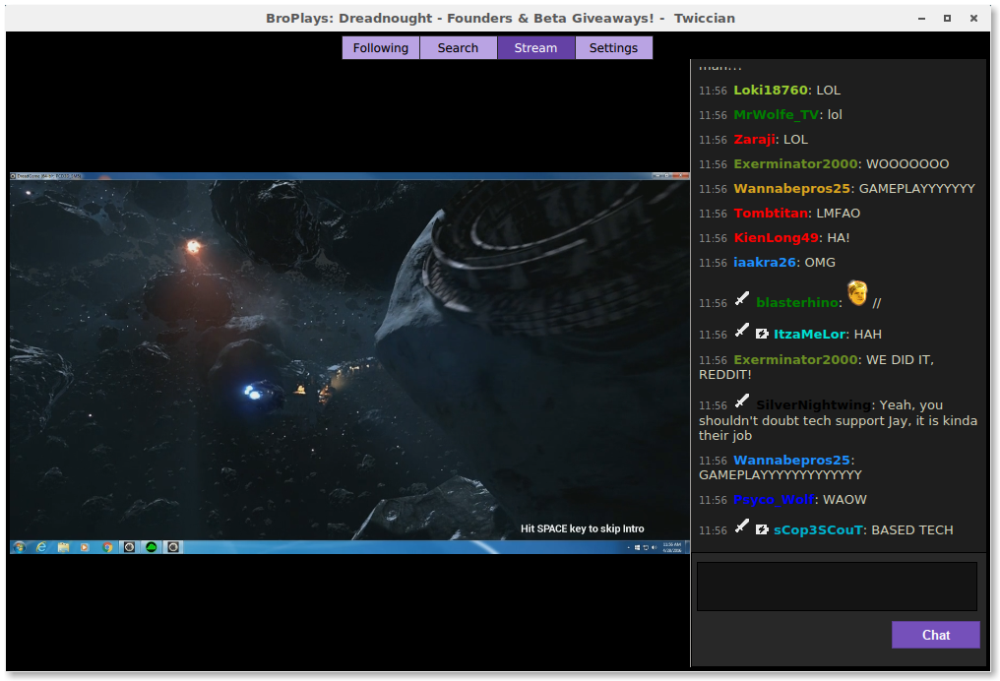
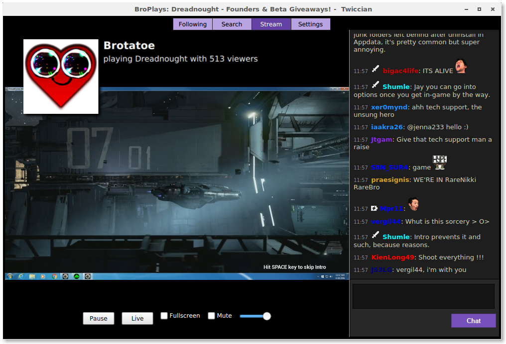

# Twiccian (v1.1)

## Project Description
Twiccian is a native desktop app written for Linux to allow the user to watch [Twitch.tv](http://twitch.tv) streams without the use of Flash or browsers and their extentions. If you have suggestions or want to see what we intend to implement, please checkout our issues. Once logged in using Twitch's OATH you will have access to the following existing features:
- Following - View any games and channels live that you currently follow
- Search - A list of live channels or games based on your search term.
- Stream - View the currently selected live stream and chat with access to player controls, profile link, and more!
- Settings - Switch between the light and dark chat themes...that's all for now!



## How it's created
Twiccian is built using Qt as the library/framework. The user-facing side of it will be written in a combination of C++ and QML, Qt's markup language used to facilitate easy creation of application interfaces. Currently, the packages required by Twiccian are only available on Arch Linux (most notably `mpv-dev` and up-to-date Qt packages),

Twiccian currently has a [background daemon](https://github.com/octotep/twicciand), written in Go, to allow for a quick background interface with Twitch, which enables us to act as an intermediary between the Twitch API and the front-end of the application, since Go makes concurrency and networking simple. The daemon can operate properly on any POSIX compliant system, but currently lacks the functionality without Twiccian.

We currently make use of Twitch chat's [IRC bridge](http://help.twitch.tv/customer/portal/articles/1302780-twitch-irc),
as well as their [REST API](https://github.com/justintv/twitch-api) and [TMI](https://tmi.twitch.tv/group/user/usernamehere/chatters) to recreate the chat in a native fashion.



## Upcoming Features (v1.2)


## Installation
Currently, Twiccian (v1.0) has a package on the AUR. This is the recommended installation method, but if you prefer a more broken experience you can use the `dev` branch if you see a new feature you'd like to try out. ;)

It can be found on the AUR under the name:
```
twiccian
```

## Dependencies
Twiccian requires the following libraries to run:
- mpv
- Qt 5.6 or greater
- youtube-dl
- rapidjson
- Go

They can be installed from pacman (recommended you use pacaur or similar):
``` 
$ sudo pacman -S qt5-base qt5-quickcontrols qt5-webengine qt5-webkit qt5-graphicaleffects mpv rapidjson youtube-dl git go
```

You'll also need to install the following go packages:
```
$ go get "github.com/walle/cfg"
$ go get "github.com/gorilla/handlers"
$ go get "github.com/gorilla/websocket"
$ go get "github.com/sorcix/irc"
```

At the moment, we don't have an official way to actually _install_ it, so if you want to use it, the above AUR package is your best option. If you want to clone this repo instead, install the dependencies for Twiccian and twicciand as mentioned and run the following (in the Twiccian directory) after successfully building `twicciand` (using go). The `sorcix/irc` library will need to be switched to the `ircv3.2-tags` branch.
```
$ qmake
$ make
```

Now that both parts of Twiccian have been built, the next part either works or needs to be worked around. Run `./twicciand` where it was built and follow the instructions from there. If you hit a 404, navigate to `~/.config/twicciand/twicciand.config` and add the following to the file:
```
user= [your username]
token= [copy the token code that appears between #access_token= and the following & in your browser]
```

Copy the two HTML files from the `assets` folder to `/usr/share/twiccian` and then restart `twicciand`. If the daemon runs without warning of no token or other errors, head over to where you built Twiccian and run the application!
```
$ ./Twiccian
```

## Known Issues
See our issue tracker for new issues and a list of currently known problems.

## Other Documentation
- [Twitch API](https://github.com/justintv/twitch-api)
- [mpv](https://github.com/mpv-player/mpv)
- [youtube-dl](https://github.com/rg3/youtube-dl)
- [TMI, simple Twitch chat json](https://tmi.twitch.tv/group/user/usernamehere/chatters) 
